# BUK Tech VR Multiplayer

During this guide you will be turning your first singleplayer VR scene into a multiplayer game with a login screen and menu.

This guide follows from the [Starting Guide](README.md) so please follow that first.

This multiplayer guide will make use of the Mirror library for multiplayer in Unity. The documentation of Mirror can be found here https://mirror-networking.gitbook.io/docs/.

## Starting Point
This guide will use the scene located in `Assets/BUK/Multiplayer/Demo/DemoSingleplayer.unity` as a starting point. The general steps used here will mostly apply to any singleplayer scene you make however.

This scene contains several basic things which are
- A VR Player controller
- The MAST holder
- A simple directional light
- A VrMode_Controller

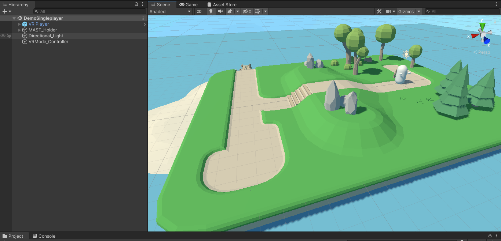

## End Result
After completing this guide you can find already implemented end results in the following files for reference.
- `Assets/BUK/Multiplayer/Demo/DemoLobby.unity`
- `Assets/BUK/Multiplayer/Demo/DemoOnline.unity`
- `Assets/BUK/Multiplayer/Demo/DemoPlayer.prefab`

## Creating a Lobby
Now we start by creating a lobby for our multiplayer scene, roughly this lobby will contain these different core parts
- The lobby UI
- A nice backdrop for the UI
- A Mirror NetworkManager

### Scene and Backdrop
For now to create a simple lobby scene with a nice backdrop we first copy the `DemoSingleplayer` scene. Afterwards we remove the objects that are not needed in the scene, in our case we only have to remove the VR Player GameObject

After removing these we want to create a nice backdrop for our UI. The simplest way of doing this is to just add a stationary Camera to the scene and make it look at a nice background.

By right clicking the scene Hierarchy you can add a camera, and by positioning and rotating it we can get a result like this

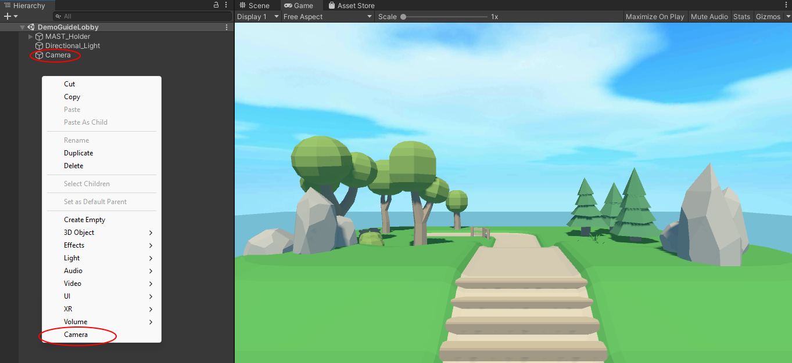

### The NetworkManager
The Mirror library provides a core `NetworkManager` component that provides all the necessary functions for multiplayer together with a simple UI. We provide an extension on top of this core to accomodate for extra features with UI and server discovery.

The extension script can be found at `Assets/BUK/Multiplayer/Scripts/BukNetworkManager.cs`. For our lobby scene we also provide a prefab with the `BukNetworkManager` already on it which is located at `Assets/BUK/Multiplayer/Prefabs/BukNetworkManager.prefab`.

After dragging the `BukNetworkManager` prefab into the lobby scene to add it, we can look at the inspector to see that we still need to fill in some values. 

The values that need to be set are the following values
- Offline Scene
- Online Scene
- Player Prefab
- Most Lobby Menu Objects

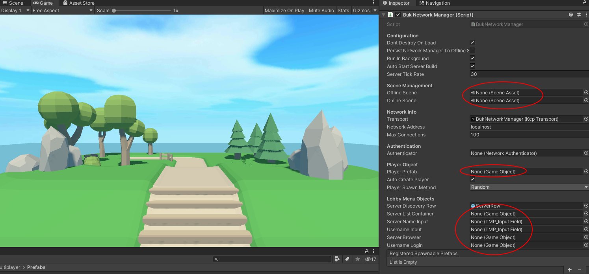

The offline scene is the scene that the `NetworkManager` should load when first starting the game, and what it should return to when disconnecting from a server. In our case we can just drag our lobby scene into this value.

The online scene is the scene that will used for playing together, here you will actually play the game after joining a server hosting this scene. We will set this later when we create the online scene.

The player prefab is the prefab that the server should spawn for each player. It will spawn it for your local player and it will also spawn this prefab for each remote player joining the server so you can see them. We will set this while creating the online scene and its player.

The lobby menu objects are all values related to the lobby UI and we will set these values in the next section.

### The Lobby UI
For a lobby UI we provide a simple UI as a prefab which can be found at `Assets/BUK/Multiplayer/Prefabs/LobbyMenu.prefab`.
This UI provides the following things
- A username screen for setting your username
- A server browser screen for hosting or joining servers

This prefab does nothing on its own but provide the UI elements to show. To actually use this UI we have to set some values in the `BukNetworkManager` and we need to bind some functions to call when clicking the buttons.

First we need to add the prefab to the scene, so just drag it into our scene. This UI is located in world space, so you will have to move, scale, and rotate it such that it is in front of the scene's camera and in full view.

We then need to set the missing values in lobby menu objects in the `BukNetworkManager`. By expanding the structure of the `LobbyMenu` prefab, we can see where to put which objects.

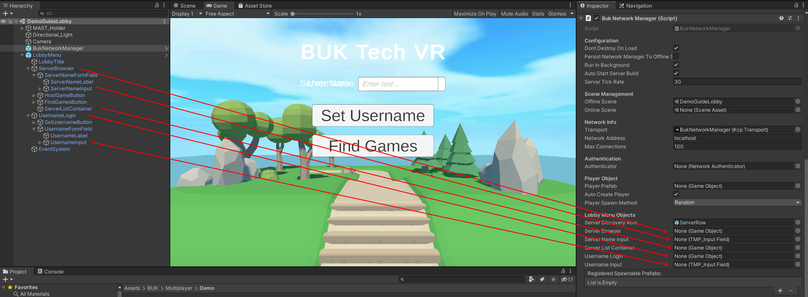

Now we need to bind the buttons to functions in our `BukNetworkManager`. For the `HostGameButton` for example we need to map it to the `HostGame()` function in the `BukNetworkManager`. We do this by first dragging the `BukNetworkManager` object into the `On Click()` event shown in the inspector of the `HostGameButton`.

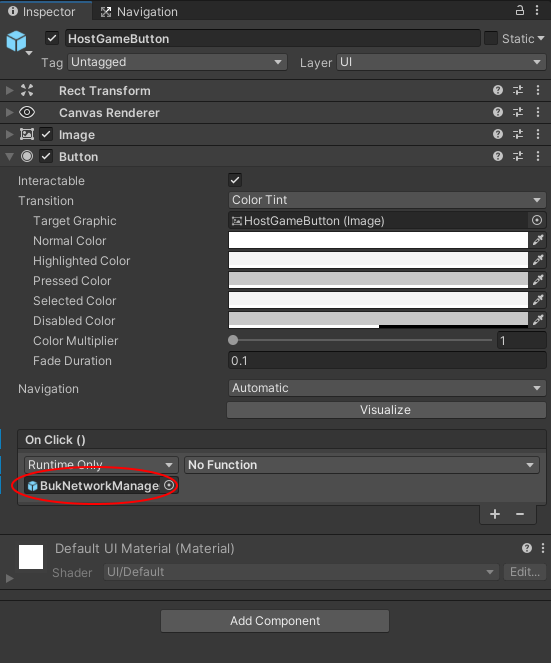

We can then select the `HostGame()` function as is shown below

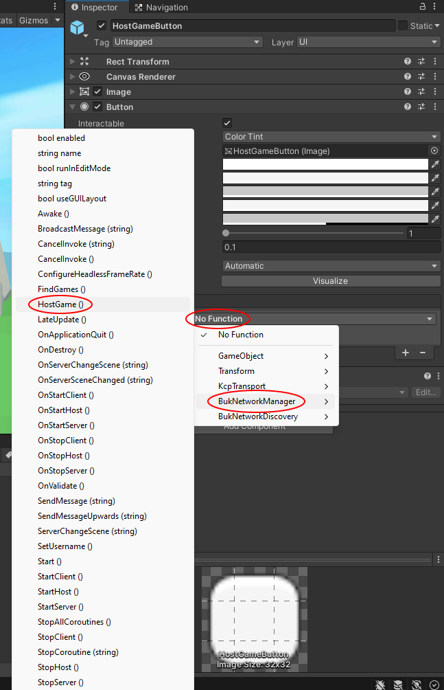

Now we repeat this process to map the buttons to functions as follows
- `HostGameButton` to `BukNetworkManager.HostGame()`
- `FindGamesButton` to `BukNetworkManager.FindGames()`
- `SetUsernameButton` to `BukNetworkManager.SetUsername()`

With this the lobby UI is pretty much finished. You can of course extend it however you want. You can now run the game and set a username. We cannot yet host a game or find any games because of the remaining missing values in the `BukNetworkManager`. These will be addressed in the next section.

## Creating a Multiplayer Scene
The multiplayer scene is actually exactly the same as the base scene we made for the lobby, before adding the lobby components. All game logic in this simple game will be contained in the player prefabs, which the `BukNetworkManager` will spawn, so we do not have to place them ourselves.

There is one this we do have to add to this scene however, and that is an object to enable VR in this scene. Our `LobbyMenu` prefab disables VR so you can use the UI outside of VR, which means we have to enable it again when we actually want to use VR.

This is actually quite simple, we just add an empty `GameObject` to the scene and call it something like "EnableVR". We then add the script we provide for enabling and disabling VR to this object. This script is located at `Assets/BUK/Scripts/VrEnabled.cs`. Then after enabling VR it should look like this

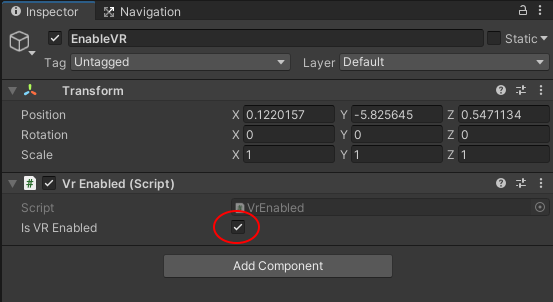

We can then drag the online scene we created into the `BukNetworkManager` in our lobby scene.

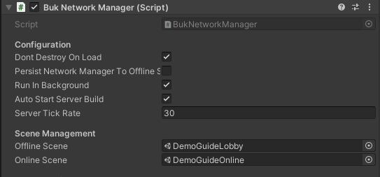

### Adding to Build Settings
Now that we have dragged this online scene to here, we need to add the online scene to the "Scenes in Build" in the Build Settings. To do this open the online scene, then open the Build Settings and click "Add Open Scenes". Then do the same for the lobby scene. Then drag the lobby scene to the top to make it load as the first scene after build.

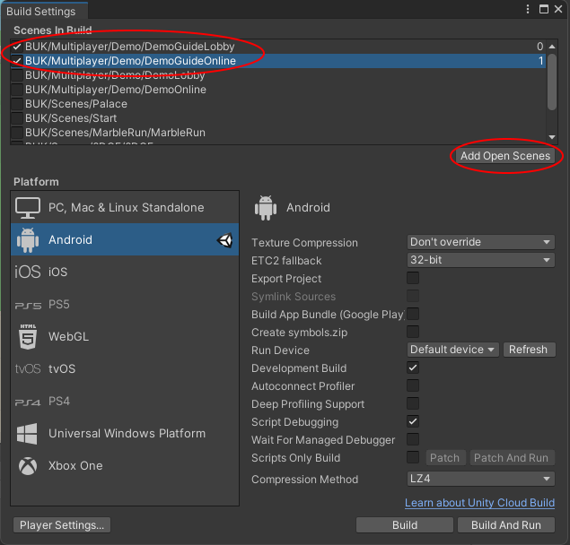

## Creating the Multiplayer Player Prefab
Most of the important game logic in multiplayer will be located in the Player object. Most functionality should be located here because a game only has permissions to change his own Player object, a game cannot change other Player objects, otherwise that would allow hacking.

### Reap the Rewards
If you want to test out your progress so far, we have supplied a full player prefab with a gun which we will be recreating in this section, you can use that for now and your multiplayer game should already work.

Just drag the prefab located at `Assets/BUK/Multiplayer/Demo/DemoPlayer.prefab` into the Player Prefab field of the `BukNetworkManager` in the lobby scene and then run the lobby scene. You can host a game or if someone else on the same local network with the same build has hosted, you can find games and then join their game.

### Adding Necessary Components
As the base of the multiplayer player prefab, we take the VR Player from the original `DemoSingleplayer` scene. Just take the VR Player object and drag it into the Unity project explorer and it will create a prefab. We will then edit this prefab to prepare it for multiplayer.

Now on the Player object inside the prefab scene we add a `NetworkPlayer` component that we provide which implements all basic functionality a multiplayer player controller would need. This script is located at `Assets/BUK/Multiplayer/Scripts/NetworkPlayer.cs`.

Note that this automatically will add a `NetworkIdentity` component as well, since the `NetworkPlayer` is a `NetworkBehaviour`, which requires a `NetworkIdentity`. 

We also need to add a `NetworkTransform` component in order to keep the position and rotation of the player object synced. This is done by clicking "Add Component" in the inspector and then looking for a "Network Transform", this is shown below.

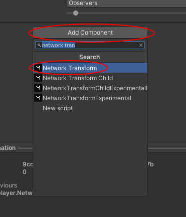

It is important to then set the "Client Authority" property of the `NetworkTransform` to `true`. This allows the local player to decide its own position and rotation.

After adding all these steps the inspector should look like this

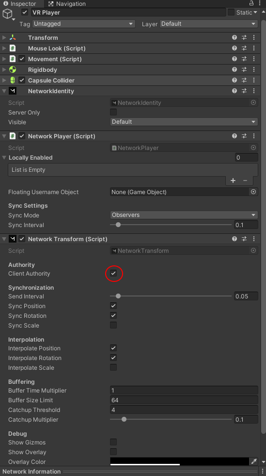

You can see that the "Locally Enabled" of the `NetworkPlayer` right now is empty, we will discuss and fill it in the next section.

### Setting Locally Enabled
The difference between a local and a remote player is whether the object belongs to my own client or to someone else's client. When I join a server it spawns a player object for me, which is the local player, and the same player object for every other client connected to the server, which are remote players from their perspective. The server then handles syncing these instances of the same player on different clients.

Because these are the same objects, we need to disable certain behaviour from the player object for all remote players, since they do not need a movement script or a camera.

The behaviours for this Player object that we only want locally enabled are as follows
- Movement (Script)
- Mouse Look (Script)
- Main Camera (The GameObject inside the Player object)

Any GameObject, component, and most other things in unity are a `Behaviour`. This just means that it can be enabled or disabled. You can add any `Behaviour` to the "Locally Enabled" property, which is done as follows.

First move the `NetworkPlayer` component view to a separate window so that is is always visible, regardless of the current selected object and inspector. How to do that is show below

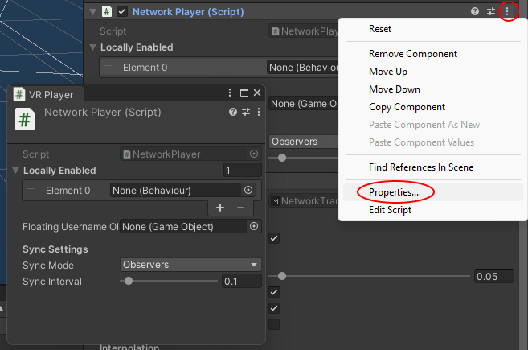

You can then add `Behaviours` to the "Locally Enabled" list by clicking the + button and dragging it into the box. After adding the three components the component should look like this

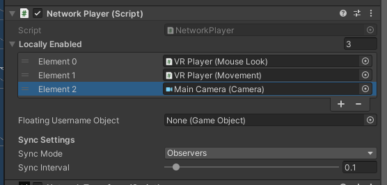

### Adding a Username
At this point the prefab is already ready to go. You can drag it into the "Player Prefab" field of the `BukNetworkManager` in your lobby scene and things are properly enabled and disabled for local and remote players.

However in the lobby and the network manager we have full support for usernames, but they are right now not shown anywhere. This is what the empty "Floating Username Object" field of the `NetworkPlayer` is about.

For this part we provide a prefab of a username object that always floats above a player's head and points towards the local player's camera at all times. This prefab is located at `Assets/BUK/Multiplayer/Prefabs/FloatingUsername.prefab`.

Just drag this prefab inside the Player object and then drag the newly added GameObject inside the "Floating Username Object" field of the `NetworkPlayer`. Then you can position the GameObject where you want, for example floating on top of the player capsule.

When playing the game now you should see other players's usernames show up like this

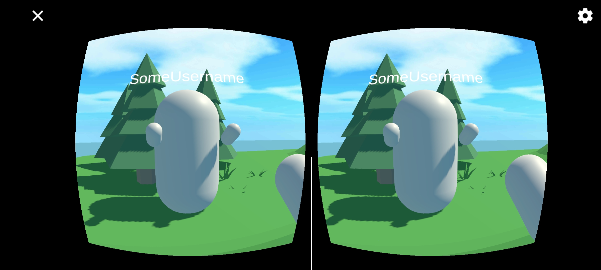

### Adding a Gun
At this point you are free to go your own way with your game, the guide has covered all the basics needed. In this section we add a gun to the player object to show an example of using Mirror's Remote Actions to implement game logic.

The documentation for Remote Actions can be found here https://mirror-networking.gitbook.io/docs/guides/communications/remote-actions

We provide several prefabs for implementing this gun. We can first add the gun by dragging the prefab at `Assets/BUK/Prefabs/Gun.prefab` into the "Right hand" object of the Player. Then you need to disable the "Input Enabled" property of the `PhysicsGun` script on the prefab. Then you need to add a bullet prefab in the "Bullet Type" field. An example is at `Assets/BUK/Prefabs/SphereBullet.prefab`.

We then add the `MultiplayerGunController` located at `Assets/BUK/Multiplayer/Scripts/MultiplayerGunController.cs` to the Player object, and then drag the gun GameObject into the "Gun Object" field. Then you can add the inputs for firing the gun to the "Triggers" field.

To understand how this works with communication between clients and the server you can read the extensive documentation provided in the `MultiplayerGunController.cs` file.

## The End
At this point you are done with our multiplayer guide. For more information about using multiplayer with Unity through Mirror you can read through the documentation at https://mirror-networking.gitbook.io/docs/.