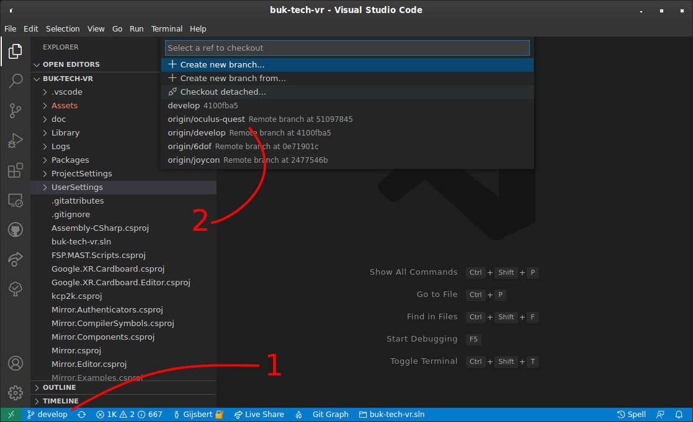
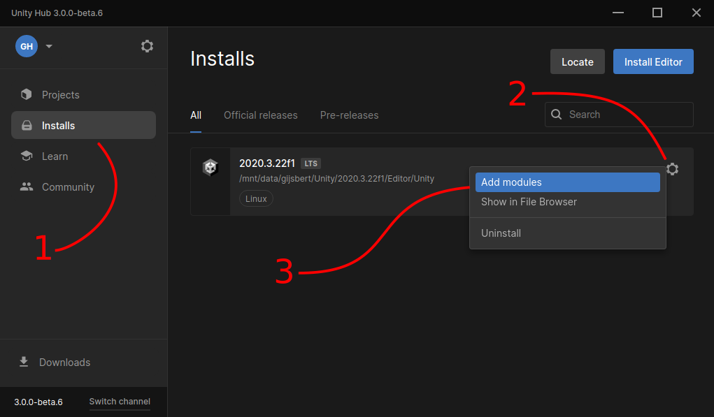
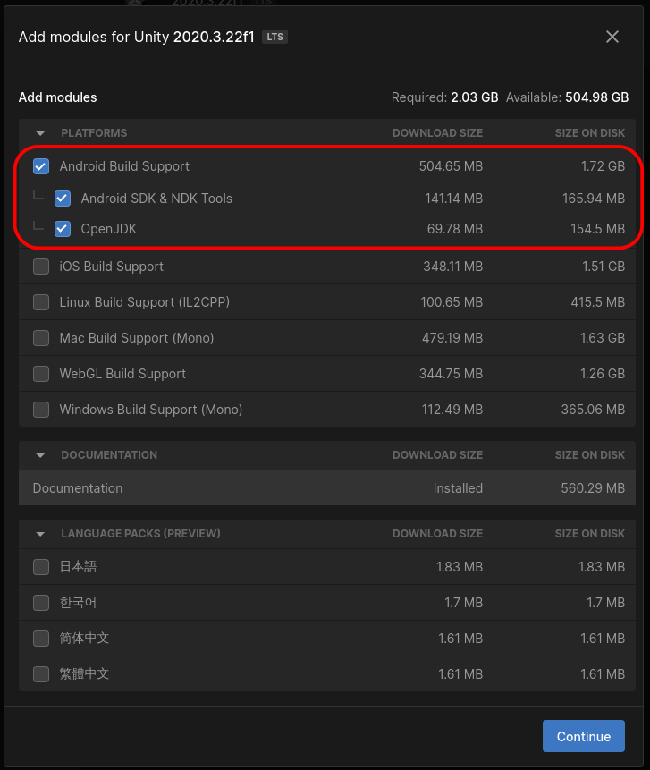
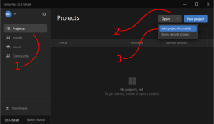
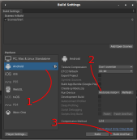
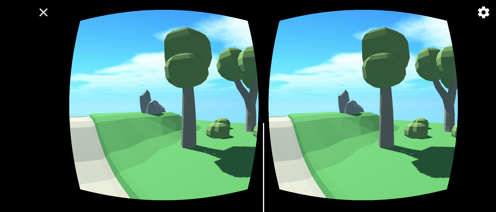

# BUK Tech VR at Påskecamp 2022

During this activity you're going to build your own virtual world in Unity 3D, put it on your Android phone, and then dive into it using Google Cardboard VR glasses.

## Requirements

- [ ] A PC or laptop for development (Windows, Mac or GNU/Linux)
- [ ] [Visual Studio Code](https://code.visualstudio.com/Download)
- [ ] Unity Hub and Engine (installation instructions below)
- [ ] `git` see [installation instructions](https://github.com/git-guides/install-git)
- [ ] An Android¹ smartphone² with at least Android 4.3 or higher capable of running 3D games³.
- [ ] A USB cable to connect your phone to your PC
- [ ] Optional: Headphones / earbuds for in-game sound. Bluetooth is best, because you won't have to mess with a cable in an awkward location.

1. Apple makes it very difficult to install a self-made iOS app to your phone. Therefore we cannot offer support for iOS during the BUK camp.
2. If you have VR glasses and _know how to deploy Unity apps to them_, you can use that. The organisation of BUK Tech cannot offer support for this. If you bring your own knowledge or a knowledgeable mentor, you're free to bring your own VR glasses.
3. If in doubt, try to install and run [InMind VR](https://play.google.com/store/apps/details?id=com.nivalvr.inmind). If that works, you'll probably be fine.

### Provided by us

- [x] Google Cardboard VR glasses. You will receive these at the BUK Tech VR activity.
- [x] A wireless controller⁴ for your smartphone. You will receive one at the BUK Tech VR activity.

4. This wil be a cheap bluetooth controller. Feel free to bring your own controller if you have one that you know works with your Android smartphone.

## Clone this repository

Follow [these instructions](https://docs.github.com/en/repositories/creating-and-managing-repositories/cloning-a-repository) to clone this repository to your local machine.

### Meta Quest 2 only

Switch to the `oculus-quest` branch in Visual Studio Code.

## Prepare your device

### Android
Follow the section [Enable developer options and USB debugging](https://developer.android.com/studio/debug/dev-options#enable) of the Android Developer user guide

### Meta Quest 2
Follow [this set of instructions](https://learn.adafruit.com/sideloading-on-oculus-quest/enable-developer-mode) to enable Developer Mode on the Meta Quest.

## Install Unity Hub

Go to the [Unity website](https://unity.com/download#create-unity-three-steps--2) and download the Unity Hub for your operating system.

### Windows

Run the downloaded file and follow the instructions to install Unity Hub

### Mac

Open the package and it should offer you to install Unity Hub

### Linux

Extract or mount the archive and run the `INSTALL.sh` script to install Unity Hub.

**Note** Unity Hub is installed in your local user account, you should not `sudo` the install script.

## Set-up Unity

Run Unity Hub from your system's application menu.

### Log in
Log in with your Unity account, or register for one. You can register and login with your Google, Facebook or Apple account, which makes this pretty easy.

#### Optionally unsubscribe from marketing e-mails

You might have signed up for e-mail spam by creating this account. [Here](https://create.unity3d.com/unity_mypage_w_accountid/) you can unsubscribe from marketing e-mails. At the very bottom of the page is the checkbox to unsubscribe globally from all Unity related marketing e-mails.

### Install Unity Editor

Once you're logged in, you'll be prompted to install Unity. Install the latest 2020 LTS version (_2020.3.32f1_ at the time of writing). You will be prompted to accept the licence terms for the software and the free _Unity Personal_ subscription.

**Note:** Unity received updates after the screenshots below were made, they show an older version number.

### Install build platform support

Once the download is completed, in the Unity hub left-hand menu, click _Installs_. You'll see version 2020.3.32f1 there. Click the gear icon in the top-right corner of that block.

You'll want to at least install _Android Built Support_, _Android SDK & NDK Tools_, and _OpenJDK_. This is necessary to be able to compile and install your game to your device. If you're using an Meta Quest, this applies too, because its OS is based on Android.

You'll have to accept the _Android SDK and NDK License Terms from Google_.

### Add the base game

In the Unity hub left-hand menu, click _Projects_. Click the arrow on the _Open_ button and select _Add project from disk_.

Then select the folder on your machine where you _cloned_ this git repository.

### Edit the base game

In Unity Hub's Projects view, click the base game you added to launch the Unity Editor and load the project for editing.

It might take some time to download and install necessary packages.

### Play in the editor

If you press the play icon in the editor, you should enter the camera viewpoint in non-VR mode and can run around with WASD, look with the mouse, and jump using space.

### Build and run the game

**Note:** If you do this process the first time you might be prompted _on the phone_ to accept the debug session from the PC.

Once the unity editor is open:

1. Connect your phone to your PC via USB cable and unlock the screen.
2. In Unity click _File_ » _Build Settings_
3. If Android is not selected, click _Android_ and click _Switch Platform_, and wait for it to finish.
4. In the _Run Device_ drop-down, select your phone.
5. Click _Build and Run_
6. Save the app as `vr.tech.buk.apk`.
7. Wait a long time until the app opens on your phone

If everything went well, you'll be prompted to allow camera access and to scan a Google Cardboard QR code. You can click _Skip_ instead of scanning such a code and it will load some default settings.

Now you should see two eye viewports that show the world and you can look around by moving the phone.

If you have a bluetooth controller that you can connect to the phone, you can probably walk around too.

**Note:** You can use the cross to exit VR mode, and the gear icon to scan a QR code.

### World building

To erase the world and build your own world:
- First erase the existing world: Delete the _MAST_Holder_ object from the scene hierarchy.
- Click _Tools_ » _MAST_ » _Open MAST Window_
- In the MAST window, click the folder icon in the bottom left corner to load prefabs.
- Choose one of the folders in _Assets/FSP/_ folder. For example _Modular Terrain_ and click _Open_
- Click one of the loaded prefabs in the MAST window to select it.
- Click in the world view to place a copy of the prefab.
- Now you can build your own world!

#### MAST Hotkeys

To change the height of the drawing grid, press <kbd>Shift</kbd><kbd>W</kbd> and <kbd>Shift</kbd><kbd>S</kbd>.  
To rotate what you are drawing press <kbd>Space</kbd>.  
To mirror what you are drawing press <kbd>F</kbd>.  
To hide the MAST grid, press <kbd>G</kbd>.  

_You have reached the temporary end of the tutorial. We are not finished writing this part yet!_

## To be added

- Improved character control
- Multiplayer
- Lobby and mini-game mechanism

## Attributions

We're using MAST and the free modular assets provided by [Fertile Soil Productions](https://fertile-soil-productions.itch.io/)
